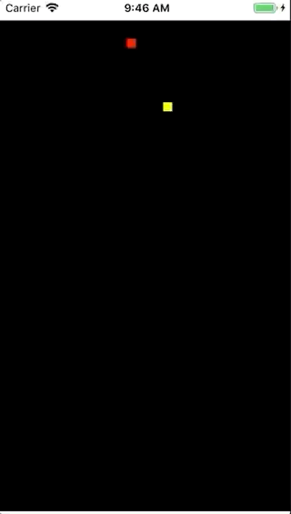

## SNAKE GAME

[](https://travis-ci.com/m10117013/SnakeGame)



| dependency |
|---|
| specta |
| expcta |
| Masonry

#### How to run

1. ``` pod install ```
2. ``` open SnakeGame.xcworkspace ```
3. ``` run SnakeGame ```

## 介紹
### 基底類別 Base

|class| 用途 | 備註 |
|---|---|---|
|SGPoint|用來表示遊戲空間的x,y座標| NSInteger
| SGSpaceItem |用來表示遊戲空間的一個block| NSInteger
| SGSize |用來表示遊戲空間的size| NSInteger
| SGSpaceContext | 用來轉換core graphics座標到遊戲座標 | |

|interface| 用途 | 備註 |
|---|---|---|
| SGDrawable |隔離view與Model的相依性 | |


####  ViewController 

|class| 用途 | 備註 |
|---|---|---|
| SinglePlayerSnakeGameViewController | 遊戲的VC |  |

### Model 

|class| 用途 | 備註 |
|---|---|---|
| SnakeModel | 蛇 |  |
| FruitModel | 水果 | |

> 透過實作SGDrawable變成可繪圖元件


### View


|class| 用途 | 備註 |
|---|---|---|
| SnakeGameBoardView | 遊戲繪圖區塊 |  |
| ScoreBoardView | 結束出現的分數表 | |
| SnakeGameMenuView | 初次遊戲的選單 | |
